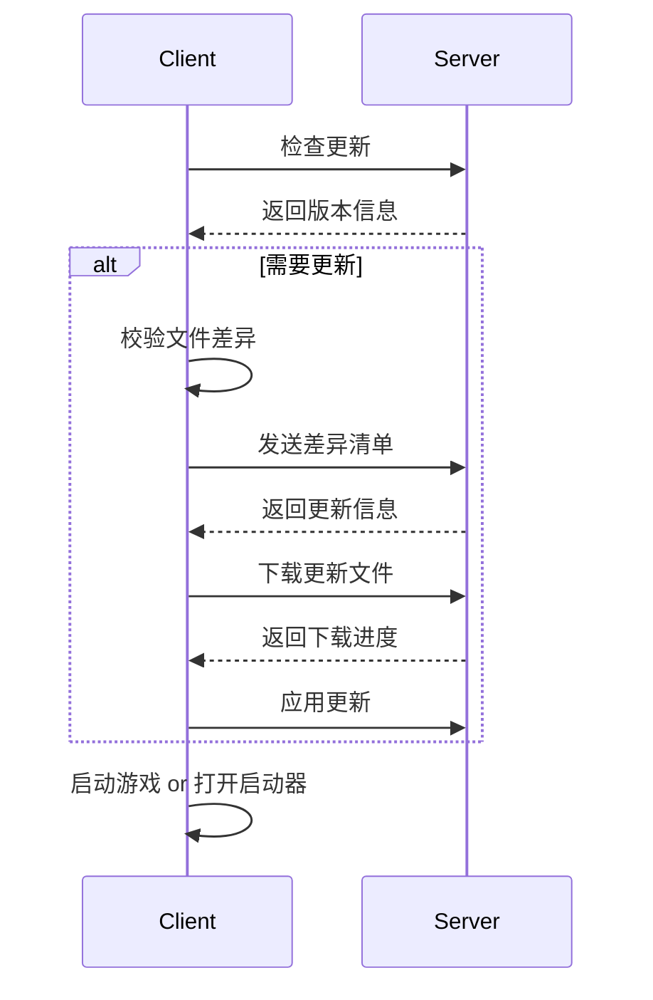

::card
---
icon: lucide:box
---
#title
你正在阅读 McHMR 2 的文档！

#content
- McHMR 1 已在 2022年12月1日 停止维护，建议使用 McHMR 2。
- McHMR 2 的采用HCSA架构（Hybrid Client-Server Architecture），提供了更灵活的扩展机制，推荐使用。
::

### 什么是 McHMR？
McHMR (全称为 Minecraft Hot Module Replacement) 是一款专为 Minecraft 服务器客户端设计的自动更新解决方案。它基于现代化的技术栈构建，提供了一套完整的、可扩展的自动更新服务体系，帮助服务器管理员高效地管理和推送客户端更新。无论是小型模组服还是大型商业服，McHMR 都能胜任。
下面是一个简易的 McHMR 客户端更新检查逻辑：

上面的图表展示了 McHMR 的简易更新流程，展现了 McHMR 的两个核心功能：
- **智能更新检测**：McHMR 基于 MD5 文件校验机制，能够精确检测客户端与服务器端文件的差异。
- **自动化更新流程**：从检查更新、下载文件到启动游戏，McHMR 提供了完整的自动化流程。

### 模块化架构
McHMR 是一个完整的生态系统，其功能覆盖了 Minecraft 客户端更新的各个方面。考虑到不同服务器的需求差异，McHMR 的设计架构为HCSA架构（Hybrid Client-Server Architecture）：

#### 管理端组件
- **McHMR-BackEnd**：基于 Java SpringBoot 企业级框架开发的管理端后端程序，提供版本管理、文件存储、更新推送等核心服务，稳定性和可扩展性得到保障。
- **McHMR-FrontEnd**：使用 Vue3 框架开发的管理端前端界面，提供直观的版本管理和更新监控功能。
- **McHMR-Docs**：完整的官方文档，包含安装部署、API 接口、使用指南等详细说明。
- **McHMR-Docs-API**：标准化的第三方 API 接口，支持其他启动器快速集成自动更新功能。

#### 用户端组件
- **McHMR-Updater**：独立的更新器程序，可集成到任何启动器或作为独立工具使用。
- **McHMR-Launcher-for-HMCL**（暂未发布）：基于 HMCL 启动器的定制版本，内置 McHMR 自动更新功能。

### 技术实现
McHMR 采用现代化的技术架构，确保系统的稳定性和可扩展性。

#### MD5 文件校验机制
在游戏客户端自动更新的架构设计中，引入基于 MD5 的文件校验机制，以确保更新过程的准确性与完整性。该方案旨在为游戏客户端的迭代与演进提供高效且可靠的更新途径。McHMR 使用基于 MD5 的文件校验机制来确保更新的准确性和完整性：

#### 工作流程
- **版本检查**：客户端向服务器查询最新版本信息
- **文件对比**：通过 MD5 校验对比本地与服务器文件差异
- **增量更新**：仅下载需要更新的文件，节省带宽和时间
- **安全校验**：下载完成后再次验证文件完整性

### 使用场景
McHMR 适用于各种 Minecraft 服务器场景，提供灵活的更新解决方案：

- **模组管理**：为模组服提供自动化的模组更新服务，支持新增、更新和删除模组，确保所有玩家使用相同的模组版本。
- **资源包更新**：快速推送资源包更新，包括材质包、音效文件、UI 资源等，提升游戏的视觉和听觉体验。
- **紧急修复**：当发现严重影响游戏体验的漏洞时，能够迅速推送修复补丁，最小化对玩家的影响。
- **营销推广**：支持动态更新启动器背景图、宣传文案等营销内容，配合服务器活动进行预热和推广。
- **性能优化**：推送优化模组和配置文件，提升游戏运行效率和稳定性。

### 为什么选择 McHMR？
- **高效可靠**：基于 MD5 校验的更新机制确保文件完整性，增量更新技术节省带宽和时间。
- **易于集成**：提供完整的 API 文档，支持快速集成到现有系统。
- **安全稳定**：多重安全校验机制，确保更新过程的安全性和稳定性。
- **灵活扩展**：模块化设计支持根据需求选择合适的组件，易于扩展和定制。
- **开源免费**：完全开源的解决方案，活跃的开发社区，持续的功能更新和优化。

### 社区与支持
- 官方文档：https://doc.dooper.top
- GitHub 仓库：https://github.com/Lunova-Studio/McHMR
- 问题反馈：https://github.com/Lunova-Studio/McHMR/issues
- 讨论社区：https://github.com/Lunova-Studio/McHMR/discussions

无论您是个人服务器管理员还是商业服运营团队，McHMR 都能为您的 Minecraft 服务器提供专业的自动更新解决方案。立即开始使用，体验现代化的更新管理方式！
